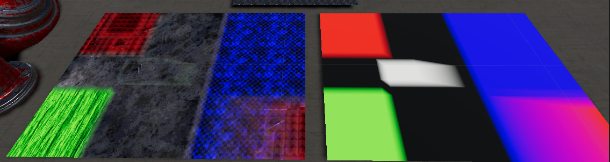
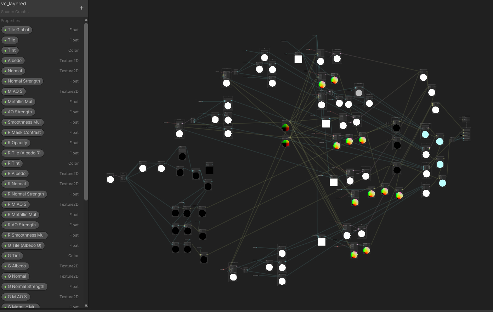
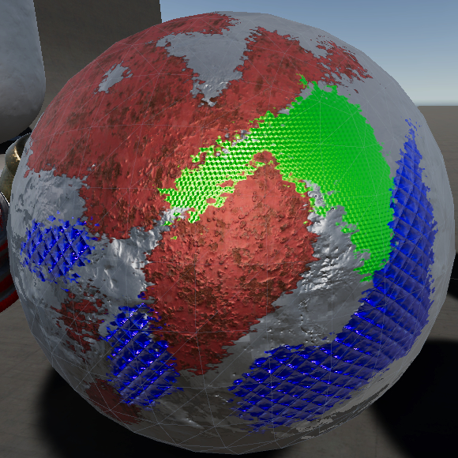
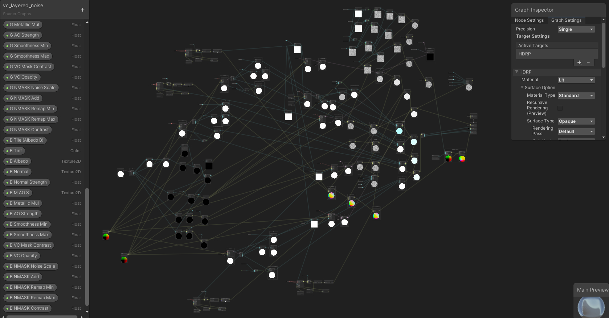

# shadergraphs

vc_layered : blend between 4 different layers using vertex color

vc_layered_noise : blend between 4 different layers using vertex color mixed with the output of the simple noise node; the layer masked with the R channel also has shadow + bump 

